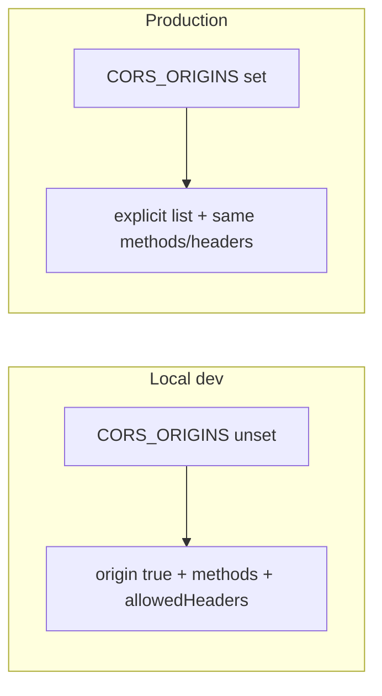

# CORS: Local dev vs future production

## Goal

- **Local dev**: No config needed; any origin works, and **preflights for PATCH + Authorization** (e.g. slide reorder) must succeed.
- **Production**: Explicit allow-list from config; no code change when you add production—only env and maybe a few options.

## Why `origin: true` alone is not enough

CORS issues were seen on the latest phase branch when testing **moving slides around**. The reorder flow uses **PATCH** with **Authorization** and **Content-Type**. The browser sends a preflight (OPTIONS); the server must respond with `Access-Control-Allow-Methods` (including PATCH) and `Access-Control-Allow-Headers` (including Authorization, Content-Type). Relying only on `origin: true` can leave methods/headers to plugin defaults, which may not match what the frontend sends—so the dev CORS config must set **explicit `methods` and `allowedHeaders`** in addition to permissive origin.

## Approach

Drive CORS from a single optional env var and `NODE_ENV`:

- **When `CORS_ORIGINS` is set**: Use it as the allow-list (comma-separated). Good for production and for testing a strict list locally.
- **When unset**: Use `origin: true` (reflect request origin) **plus** explicit methods and allowedHeaders (see below) so slide reorder and other mutations work in dev.

Optionally treat production as “must be explicit”: if `NODE_ENV === 'production'` and `CORS_ORIGINS` is unset, either fail fast at startup or default to a safe value (e.g. no CORS). That avoids accidentally running production with permissive CORS.

## Implementation

**1. Single CORS config in [apps/api/src/main.ts](apps/api/src/main.ts)**

- Read `process.env.CORS_ORIGINS` (and optionally `NODE_ENV`).
- Define shared options (used for both dev and production), in one place so future changes are trivial:
  - **methods**: `['GET','HEAD','POST','PUT','PATCH','DELETE','OPTIONS']` — covers all current routes (decks, slides, blocks, data-sources, auth) and standard REST; HEAD for conditional/health if needed.
  - **allowedHeaders**: `['Content-Type','Authorization','Accept','Accept-Language']` — covers JSON, Bearer auth, and content-negotiation (e.g. export as PDF in polish phase) or i18n without a CORS change.
  - **Extension point**: If a future endpoint or frontend change sends a **new custom header** (e.g. `X-Export-Format`), add it to this allowedHeaders array in `main.ts` only; no env or second config.
- Build origin and register once at startup:
  - If `CORS_ORIGINS` is non-empty: split by comma, trim, pass as `origin: array` plus the shared methods/headers.
  - Else: use `origin: true` plus the same methods and allowedHeaders (so preflights for slide reorder etc. succeed).
- (Optional) If `NODE_ENV === 'production'` and `CORS_ORIGINS` is unset: log a warning and use a strict default or `process.exit(1)` so production never runs with permissive CORS.

**2. Document the contract**

- In [apps/api/.env.example](apps/api/.env.example): add a commented `CORS_ORIGINS` line with an example for production (e.g. `https://app.yourdomain.com`) and a note that leaving it unset is fine for local dev.
- In API or repo README: one line that “production should set `CORS_ORIGINS` to a comma-separated list of allowed frontend origins.”

**3. Update doc: [docs/updates/](_docs/updates/)**

- Add a new file in `_docs/updates/` for this CORS change (e.g. `cors-dev-production.md`). Use it as the prompt/definition for the update: scope (env-driven CORS, dev vs prod, why methods/headers are required for slide reorder), and pointer to main.ts and .env.example. Same spirit as [docs/updates/workflow-update-2026-March-04.md](_docs/updates/workflow-update-2026-March-04.md)—short, actionable.

**4. Progress doc when work is complete: [docs/progress/](_docs/progress/)**

- After implementation is done and reviewed, add a progress note under `_docs/progress/miscellaneous/` (e.g. `cors-dev-production.md`), following the pattern of [docs/progress/miscellaneous/docker-compose-migrations.md](_docs/progress/miscellaneous/docker-compose-migrations.md): short summary, deliverables (env-driven CORS, dev vs prod, methods/headers, docs), and note that it's tracked under miscellaneous.

**5. No other call sites**

- CORS is only registered in `main.ts`; no other code changes.

## Future-proofing for remaining milestones

- **02-mvp/04-slide-editor, 05-viewer**: All API usage is GET/POST/PATCH/DELETE with Authorization and Content-Type; the shared methods and headers above cover them.
- **03-post-mvp/01-polish**: Chart work is frontend-only. Optional export (e.g. PDF/image) may add endpoints that use `Accept` for response type; including `Accept` (and `Accept-Language`) in allowedHeaders now avoids CORS issues later.
- **Anything else**: New HTTP methods are rare (we already allow the full REST set). The only likely need is a new **custom request header** from the frontend—add it to the single shared `allowedHeaders` array in `main.ts` when you introduce it. No need to over-engineer beyond that.

## Production later

When you add production:

- Set `CORS_ORIGINS` in the production environment to the real frontend URL(s) (e.g. `https://app.example.com`).
- If you need credentials or more headers, extend the same options object (e.g. `credentials: true`, more `allowedHeaders`); the “explicit list” path already supports that without touching the dev path.

## Summary

| Environment | CORS_ORIGINS   | Behavior                                  |
| ----------- | -------------- | ----------------------------------------- |
| Local dev   | unset          | `origin: true` + methods + allowedHeaders |
| Production  | set (e.g. URL) | Explicit allow-list from env              |
| Optional    | set in dev     | Test strict list locally                  |

One block in `main.ts` (shared methods/headers for dev and prod), one env var, `.env.example`, an update doc in `_docs/updates/`, and a progress doc in `_docs/progress/miscellaneous/` when complete keeps dev working (including slide reorder) and production safe without stepping on future work.
