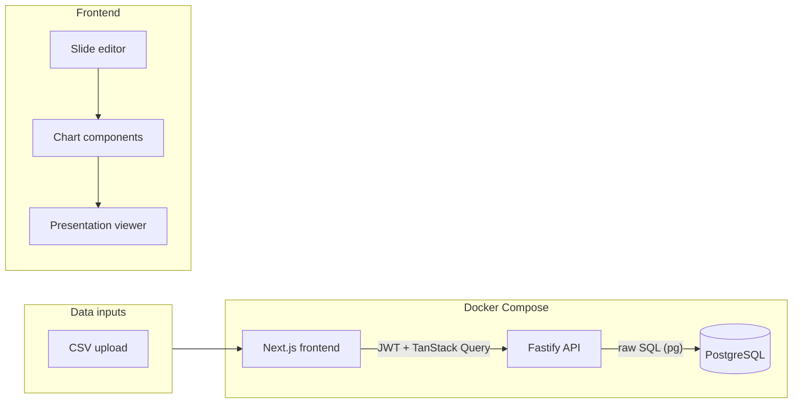

# Interactive Presentation App (Next.js, Fastify, Postgres, no ORM)

## Goal

A browser-based app where users can build PowerPoint-like slide decks, add interactive charts bound to CSV (or Excel-exported) data, and view presentations with live chart interactions. **On mouse-over, chart elements show data from the underlying data source** (e.g. the full row or selected columns from the CSV). A dedicated Fastify backend handles JWT auth and serves data from Postgres using raw SQL (no ORM). The frontend uses TanStack Query to fetch and mutate that data.

## Architecture (high level)

- **Editor**: Canvas for slides (title, text, images, chart placeholders). Per-slide or global data source binding (CSV). Chart type and field mapping per chart.
- **Charts**: Recharts (recommended) or Chart.js, with **custom tooltips** that receive the underlying data row and display source fields (e.g. all CSV columns for that row, or a configurable subset).
- **Viewer**: Full-screen slide-by-slide view (keyboard/click navigation); same chart components so hover tooltips work during “presentation”.
- **Persistence**: PostgreSQL stores users (for JWT), decks, slides, data sources, and chart configs. The Fastify backend uses raw SQL (`pg`) only—no ORM.

## Tech stack

| Layer        | Choice                  | Why                                                                                                                              |
| ------------ | ----------------------- | -------------------------------------------------------------------------------------------------------------------------------- |
| Frontend     | Next.js (App Router)    | UI, routing (edit/view), optional SSR; all data from Fastify API.                                                                |
| Backend      | Node + Fastify          | JSON API, JWT auth (e.g. @fastify/jwt + auth routes), raw SQL via `pg`; no ORM. CSV upload and parse (Papa Parse) on the server. |
| Auth         | JWT                     | Stateless; Fastify verifies token on protected routes; frontend stores token and sends in Authorization header.                  |
| Database     | PostgreSQL              | Relational store for users, presentations, slides, data_sources, chart configs.                                                  |
| DB access    | Raw SQL (`pg`)          | No ORM; write SQL for schema (migrations as SQL files) and queries. Full control and no abstraction layer.                       |
| Server state | **TanStack Query**      | Fetch/cache/mutate Fastify API data; loading/error states, refetch, invalidation; keeps UI in sync with backend. Recommended.    |
| Charts       | **Recharts**            | Custom tooltip shows underlying data row on hover.                                                                               |
| Styling      | Tailwind or CSS modules | Scoped styles, editor vs viewer layout.                                                                                          |

**Recharts vs Chart.js for “show data from underlying source on hover”**

**Why TanStack Query** — Frontend talks only to the Fastify API. TanStack Query gives one place for server state: useQuery for GET (decks, slides, data sources, rows) and useMutation for POST/PUT/DELETE. Handles loading/error, caching, refetch, and cache invalidation after mutations.

- **Recharts**: Use a custom `<Tooltip content={...} />` that receives `payload` (e.g. `payload[0].payload` is the raw data object for that point). Render that object’s keys/values (or a configured subset) in the tooltip so users see the actual source row.
- **Chart.js**: Use `options.plugins.tooltip.callbacks` and pass the full datapoint to show extra fields from the source row. Valid alternative if you prefer its API.
- **Recommendation**: Recharts for React/Next.js fit and straightforward custom tooltips that show underlying data.

## Core features (MVP)

1. **Project/slides model**

- Deck = ordered list of slides; each deck has visibility (public/restricted) and optional viewer allow-list or share tokens.
- Each slide = ordered list of **blocks**. Each block has type (text or chart), layout (position/size or grid slot), and type-specific content.
- Text block: title/body, formatting.
- Chart block: **one associated data set** (data source id) plus chart config (chart type, column-to-axis/series mapping). The chart always reads from that data set in both edit and view modes.

1. **Data sources**

- Upload CSV to Fastify; parse with Papa Parse on server and persist via raw SQL (or in a “sources” store).
- Support multiple CSVs; user names each and selects one per chart. Upload goes to Fastify.

1. **Slide editor**

- Add/remove/reorder slides.
- Per slide: add text blocks, add “chart” block.
- For a chart block: choose data source (parsed CSV), chart type (e.g. bar, line, pie), and map columns to axes/series (e.g. category vs value).

1. **Interactive charts**

- Render from current data and mapping; legend, axis labels.
- **Custom tooltips on hover**: show underlying source data (e.g. the full CSV row or configured columns) so viewers can see exact values from the data source when hovering over a point/bar/slice.
- Same chart components used in editor (preview) and in viewer.

1. **Viewer**

- Full-screen, slide navigation (next/prev, optional keyboard).
- Charts remain interactive (hover, click if you add filters later).

## Edit mode vs View mode

**Edit mode** (route: `edit/[...deckId]`)

- **Layout**: Users can place and arrange **text** and **chart** blocks on each slide. Layout can be a simple grid or free-form (e.g. position/size per block). Each slide has an ordered list of blocks; each block has type (text or chart), position, and optional dimensions. Text blocks: title, body, formatting. Chart blocks: a placeholder that displays the chart and is configured via a properties panel.
- **Associating data with a chart**: For every chart block, the user selects **one data set** (an uploaded CSV/data source) from their available sources. They then map that data set’s columns to the chart (e.g. category axis, value axis, series). That association (data source id + column mapping) is stored with the chart config so the same chart always uses that data set when viewed or edited.
- **Entry**: Edit mode requires auth; backend returns deck/slides only if the user has **edit** permission for that deck. UI: slide list (e.g. sidebar), canvas for the current slide, properties panel for the selected block (text content or chart data source + mapping).

**View mode** (route: `view/[deckId]`)

- **Layout**: Slides are shown one at a time, full-screen (or near full-screen). No layout editing; only navigation (next/prev, optional slide list or progress). The same slide/chart components as in edit are rendered in read-only form so charts remain interactive (e.g. hover tooltips).
- **Entry**: User opens the view URL. Access is controlled by **roles and permissions** (see below): view can be public or restricted.

**Roles and permissions**

- **Edit vs view**: Ability to **edit** or only **view** a deck is determined by roles/permissions, enforced on the backend (Fastify): e.g. “can edit deck X”, “can view deck X”. Only users with edit permission can access edit mode and mutate slides/settings; others may only view (if they have view permission) or get 403.
- **View visibility**: View access can be:
  - **Public**: Anyone with the view link can open the presentation (no login required; optional unlisted URL or share token).
  - **Restricted**: Only certain users or roles can view (e.g. list of user ids, or “viewer” role for that deck). Backend checks permission before returning deck/slides for view; unauthenticated or unauthorized requests get 401/403.
- **Data model**: Store per-deck visibility (e.g. `visibility: 'public' | 'restricted'`) and, when restricted, an allow-list (e.g. `deck_viewers` table or role-based rules). Optionally: share links with tokens that grant view-only access without requiring the viewer to have an account. Fastify auth middleware + a small “can view deck” / “can edit deck” check in the relevant routes.

## Suggested project structure

- **Frontend (Next.js)**
  - `app/` — `layout.tsx`, `page.tsx`, `edit/[[...deckId]]/page.tsx`, `view/[deckId]/page.tsx` (no API routes; all data from Fastify).
  - `components/` — reusable UI, `slides/`, `charts/` (Recharts + custom Tooltip), `editor/`, `viewer/`.
  - `lib/` or `hooks/` — TanStack Query client setup, auth helpers (store token, attach to requests), API client that calls Fastify base URL with JWT.
- **Backend (Fastify)**
  - Routes: auth (login/register, issue JWT), decks CRUD, slides CRUD, data_sources (upload CSV, list, get rows). Deck read routes (for view) accept deck id and optionally a share token; enforce view permission (public vs restricted, allow-list) before returning slides. Edit/mutation routes require JWT and edit permission for that deck.
  - Auth: `@fastify/jwt` (or similar), middleware that verifies JWT on protected routes; plus permission helpers (e.g. canViewDeck, canEditDeck) used in route handlers.
  - DB: `pg` only; schema includes decks (e.g. owner_id, visibility, optional share_token), and per-deck viewer allow-list or roles when visibility is restricted. SQL folder for schema and migrations.
- **Docker Compose**
  - Services: `frontend` (Next.js), `api` (Fastify), `db` (Postgres). `DATABASE_URL` for API; frontend `NEXT_PUBLIC_API_URL` (or similar) for Fastify base URL.

## Implementation order

1. **Scaffold** — Next.js frontend + Fastify backend + Docker Compose (frontend, api, db). Postgres schema as raw SQL (users, presentations, slides, data_sources, rows or JSONB).
2. **Auth and permissions** — Fastify: register/login routes, issue JWT; protected route middleware. Deck-level permissions: store visibility (public/restricted) and viewer allow-list (or share tokens); add canViewDeck / canEditDeck checks so view can be public or restricted and edit is restricted to allowed users. Frontend: login UI, store token, API client with Authorization header.
3. **Data layer (backend)** — Fastify routes: CSV upload (Papa Parse + raw SQL), list data sources, get rows; decks/slides CRUD. Frontend: TanStack Query (useQuery/useMutation). “data sources” 3. **Chart pipeline** — One chart type (e.g. bar) with Recharts; custom Tooltip that displays underlying data row (e.g. payload[0].payload) so hover shows source fields.
4. **Slide model + editor** — Create/edit slides; add “chart” block and wire to data source + chart config.
5. **Viewer** — Full-screen slide renderer at view/[deckId]; next/prev and keyboard; same chart components with tooltips.
6. **Polish** — More chart types, axis/labels, optional export.

## Out of scope for MVP (can add later)

- Real-time collaboration.
- Export to PDF/PPTX (would require a backend or client-side lib).
- Excel binary (.xlsx) upload (would add a lib like SheetJS); CSV from Excel is enough for MVP.

## Risks / decisions

- **Large CSVs**: Store parsed rows in Postgres (JSONB or normalized rows); for very large files, consider sampling or pagination when loading into charts.
- **Chart types**: Start with bar and line; add pie/area as needed. Recharts supports all of these.

If you want to proceed, next step is to scaffold the Next.js frontend, Fastify backend, and Docker Compose (with Postgres); define the DB schema in raw SQL; then add JWT auth and the first Fastify data endpoints, with TanStack Query on the frontend.
