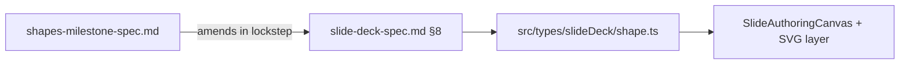

# Milestone Spec: Slide Deck Shapes (v1)

## Authority and relationship to the codebase

**Canonical schema** for shapes is [`slide-deck-spec.md`](slide-deck-spec.md) **§8** (Shapes), mirrored in TypeScript as [`src/types/slideDeck/shape.ts`](../src/types/slideDeck/shape.ts) and [`src/types/slideDeck/fill.ts`](../src/types/slideDeck/fill.ts).

This milestone document adds **field-level** detail, SVG rendering contracts, and UX expectations for shapes v1. Any **new** fields or enum members introduced here must land as **additive updates** to slide-deck-spec §8 and the same TypeScript types in the same change set—do not maintain a parallel type system in prose.

**Persistence:** The authoring app today keeps slide elements in **in-memory** document state (`SlideElement[]` with a `spec` payload). When storage matches slide-deck-spec §6, each slide-owned shape serializes as a `slide_elements` row with `element_type = "shape"` and a JSON **`spec_json`** column whose object matches `ShapeSpec`. Examples below use the **runtime** shape `spec` embedded on `SlideElement`; when describing SQLite, call out `spec_json` explicitly.



---

## 1. Purpose and scope

This document specifies the **shapes milestone** for the slide deck authoring layer. It is an 80/20 implementation: ship the shapes that cover the majority of management-consultant slide patterns at low implementation cost, while keeping the representation forward-compatible with AI-assisted shape generation (`custom_polygon` + `path_data`).

**In scope for this milestone:**

- `rectangle`, `rounded_rectangle`, `circle`, `ellipse`, `triangle`
- Straight **line** (stroke: weight, cap, dash, color — no arrowheads on the line kind)
- **Arrow** (`shape_kind: "arrow"`) — directionality via `line_start` / `line_end` ([`LineEndSpec`](../src/types/slideDeck/shape.ts)): single-ended vs double-ended, open vs filled heads, etc.
- Editable fill (solid and none for this milestone’s product scope)
- Editable border (color, weight, style) or `border: null`
- Opacity via **`FillSpec.opacity`** (see §3)
- Shape insertion, selection, move, and delete within the existing canvas model; resize/rotate and rich interactions as **target** behavior where noted (see §8)
- Right-panel property inspector for shapes (**target** UI — see §7)
- Persistence of `ShapeSpec` inside the slide element payload (and in `spec_json` when using SQLite)

**Explicitly out of scope for this milestone (v2+ candidates):**

- Gradient and **image** fills in the product UI for shapes (the shared `FillSpec` type already allows `gradient` / `image`; this milestone does not require exposing them for shapes)
- Callout bubbles, stars, banners, and other decorative shape libraries
- `parallelogram`, `diamond` — present on `ShapeKind` for forward compatibility; **not** required rendering targets for this milestone
- Freehand / arbitrary polygon authoring (beyond reserved `custom_polygon`)
- Shape grouping
- Shape-to-shape connectors with magnetic endpoints
- Full AI-authored vector shapes (forward-compatible via `custom_polygon`; see §9)
- Shape text labels (use an overlaid text box)
- PPTX export of shapes

---

## 2. Shape primitive set

`ShapeKind` is the single discriminant (see [`shape.ts`](../src/types/slideDeck/shape.ts)). This milestone implements a **subset**; other enum members remain valid for typed persistence but may render as placeholders until implemented.

| `shape_kind` | Description | Key parameters |
|---|---|---|
| `rectangle` | Axis-aligned rectangle or square. Sharp corners. | — |
| `rounded_rectangle` | Rounded rectangle. | `corner_radius_emu` (see slide-deck-spec §8; preview: [`SlideShapeRectPreview.tsx`](../src/components/slideDeck/SlideShapeRectPreview.tsx)) |
| `circle` | Circle. | Use a **square** layout box (`width === height`); renderer treats as circle inside the box. |
| `ellipse` | Ellipse (non-circular). | Bounding box defines axes. |
| `triangle` | Isosceles triangle, apex up by default. | Combine with `rotation_deg` for other orientations. |
| `line` | Stroke-only segment. No arrowheads. | `line_stroke` (milestone addition, §3). End markers absent or `none`. |
| `arrow` | Directed stroke or filled arrow geometry. | `line_start` / `line_end` for single vs double arrow; optional advanced head geometry (§3, §4). |

**Not in this milestone (kinds exist on the enum):** `parallelogram`, `diamond`, `custom_polygon`.

All shapes use the same [`SlideElement`](../src/types/slideDeck/slide.ts) layout box: `x`, `y`, `width`, `height`, `rotation_deg`, `z_index`, `locked`, `hidden`. The shape payload lives in **`spec`** (`ShapeSpec`); in SQLite that JSON is stored in **`spec_json`**.

### 2.1 Line vs arrow

- **Line** (`shape_kind: "line"`) — a **stroke** primitive. No semantic direction; use for rules, dividers, underlines. Visual weight comes from `line_stroke`, not from fill.
- **Arrow** (`shape_kind: "arrow"`) — use for flow and sequence. Direction and head style use **`line_start`** and **`line_end`** (`LineEndSpec.marker`). Single arrow: one end `arrow` or `arrow_open`, the other `none`. Double arrow: both ends non-`none` arrow markers.

Do not represent a stroked line by abusing `arrow` with “blunt” heads; keep kinds distinct.

---

## 3. `ShapeSpec` type definition

The following **extends** the stub in slide-deck-spec §8—it does not replace it. Names and optionality follow the canonical interfaces unless noted as **milestone additions**.

```ts
// ─── Canonical excerpts (slide-deck-spec §8 / src/types/slideDeck/shape.ts) ─

export type ShapeKind =
  | "rectangle"
  | "rounded_rectangle"
  | "circle"
  | "ellipse"
  | "line"
  | "arrow"
  | "triangle"
  | "parallelogram"
  | "diamond"
  | "custom_polygon";

export interface LineEndSpec {
  marker: "none" | "arrow" | "arrow_open" | "circle" | "square";
  size: "small" | "medium" | "large";
}

export interface BorderSpec {
  color: string;
  width_pt: number;
  style: "solid" | "dashed" | "dotted" | "none";
}

/** slide-deck-spec §4.5 — includes solid / gradient / image / none; milestone UI focuses on solid + none for shapes */
// GradientSpec: see src/types/slideDeck/fill.ts
export interface FillSpec {
  kind: "solid" | "gradient" | "image" | "none";
  color?: string;
  gradient?: GradientSpec;
  image_asset_id?: string;
  /** 0–1; use for shape fill transparency (preferred over a duplicate field on ShapeSpec) */
  opacity?: number;
}

export interface ShapeSpec {
  shape_kind: ShapeKind;
  fill: FillSpec;
  border: BorderSpec | null;
  /** Rounded corners — for `rounded_rectangle` per slide-deck-spec */
  corner_radius_emu?: number;
  /** For `line` and `arrow`: which ends show markers */
  line_start?: LineEndSpec;
  line_end?: LineEndSpec;
  path_data?: string; // for `custom_polygon`

  // ─── Milestone additions (add to §8 + shape.ts with the same semantics) ───

  /** Stroke for `line` / `arrow` rendering. Required for `line` when implementing stroke UI. */
  line_stroke?: LineStrokeSpec;

  /** Optional SVG viewBox for scaling custom polygon paths (with path_data) */
  path_viewbox?: string;
  /** Future: natural-language description for AI regeneration */
  path_description?: string;

  /**
   * Optional filled-shaft geometry for arrow (PowerPoint-style chevron body).
   * If omitted, render heads from LineEndSpec + stroke only.
   */
  arrow_geometry?: ArrowHeadGeometrySpec;
}

/** Milestone addition — stroke for line/arrow */
export interface LineStrokeSpec {
  weight_pt: number;
  cap: "butt" | "round" | "square";
  style: "solid" | "dashed" | "dotted";
  color: string; // palette slot or hex
}

/** Milestone addition — optional ratios for filled arrow shaft (see §4) */
export interface ArrowHeadGeometrySpec {
  head_style: "chevron" | "open" | "blunt" | "circle";
  shaft_weight_ratio: number;
  head_depth_ratio: number;
}
```

### 3.1 Design decisions

**Line as stroke.** The `line` kind should render via SVG `<line>` (or equivalent) with `stroke-width` from `line_stroke`, not as a thin filled rect. `border` and fill are not used for stroke color for `line` in the renderer; use `line_stroke.color`.

**Palette slots.** Colors resolve through the active theme ([`resolveFillToCss`](../src/slideDeck/resolveFillToCss.ts), color palette on [`SlideDeckTheme`](../src/types/slideDeck/theme.ts)).

**Opacity.** Use **`FillSpec.opacity`** (0–1) for fill transparency. Avoid duplicating a second top-level opacity on `ShapeSpec` unless a future requirement needs whole-element alpha separate from fill (not in this milestone).

**Border.** Prefer `border: null` when there is no border ([`SALARY_VARIANCE_TITLE_ACCENT_SHAPE_SPEC`](../src/slideDeck/salaryVarianceLayout.ts)). A zero-width border object is also acceptable if validation normalizes it.

**`custom_polygon`.** Reserved for v2 / AI: `path_data` (+ optional `path_viewbox`, `path_description`). Not rendered in v1 beyond a safe placeholder; must not crash load.

---

## 4. SVG rendering contract

The canvas layer should translate `ShapeSpec` + the element layout box into SVG (today’s authoring canvas may still use simplified CSS boxes for some kinds until this milestone lands—see §8). Coordinates assume a local box of width `W`, height `H`; the renderer maps EMU to pixels and applies `rotation_deg` around the box center.

Fill opacity: use `FillSpec.opacity` when present. Border dash mapping:

| `BorderSpec.style` | SVG `stroke-dasharray` |
|---|---|
| `solid` | none |
| `dashed` | `{8 * scale} {4 * scale}` |
| `dotted` | `{2 * scale} {3 * scale}` |
| `none` | no stroke |

`scale` follows px-per-point at the current zoom.

### Rectangle / rounded rectangle / circle / ellipse / triangle

Standard `<rect>` / `<ellipse>` / `<polygon>` with fill and stroke from `fill`, `border`, and `FillSpec.opacity`. For `rounded_rectangle`, `rx`/`ry` from `corner_radius_emu`. For `circle`, use a circle centered in the box with radius `min(W,H)/2`.

### Line

Horizontal stroke from `(0, H/2)` to `(W, H/2)` in local space; use `rotation_deg` for other angles. Minimum hit-target height: `max(line_stroke.weight_pt * px_per_pt, 8px)` in screen space.

### Arrow

1. **Marker-based (canonical with `LineEndSpec`):** render `line_start` / `line_end` using SVG markers or path caps consistent with `marker` and `size`.

2. **Optional `arrow_geometry`:** if present, the filled polygon recipes from the previous revision of this doc (shaft + head ratios) may be used for chevron-style bodies; open heads may use `<polyline>` for the head portion.

---

## 5. Persistence

No new tables. In SQLite, shapes are `slide_elements` rows with `element_type = "shape"` and `spec_json` containing `ShapeSpec`. In app state, the same object is the element’s **`spec`**.

### Example (`SlideElement` shape — rectangle, no border)

```json
{
  "id": "elem_abc123",
  "slide_id": "slide_xyz",
  "element_type": "shape",
  "x": 457200,
  "y": 914400,
  "width": 1828800,
  "height": 914400,
  "rotation_deg": 0,
  "z_index": 2,
  "locked": false,
  "hidden": false,
  "layout_element_id": null,
  "created_at": "2026-01-01T00:00:00.000Z",
  "updated_at": "2026-01-01T00:00:00.000Z",
  "spec": {
    "shape_kind": "rounded_rectangle",
    "fill": { "kind": "solid", "color": "accent_1", "opacity": 1 },
    "border": null,
    "corner_radius_emu": 91440
  }
}
```

### Example — line (stroke)

```json
{
  "id": "elem_line001",
  "slide_id": "slide_xyz",
  "element_type": "shape",
  "x": 457200,
  "y": 3429000,
  "width": 11277600,
  "height": 127000,
  "rotation_deg": 0,
  "z_index": 1,
  "locked": false,
  "hidden": false,
  "layout_element_id": null,
  "created_at": "2026-01-01T00:00:00.000Z",
  "updated_at": "2026-01-01T00:00:00.000Z",
  "spec": {
    "shape_kind": "line",
    "fill": { "kind": "none" },
    "border": null,
    "line_start": { "marker": "none", "size": "medium" },
    "line_end": { "marker": "none", "size": "medium" },
    "line_stroke": {
      "weight_pt": 2.0,
      "cap": "butt",
      "style": "solid",
      "color": "dark_1"
    }
  }
}
```

### Example — single-ended arrow

```json
{
  "id": "elem_arr001",
  "slide_id": "slide_xyz",
  "element_type": "shape",
  "x": 0,
  "y": 0,
  "width": 914400,
  "height": 127000,
  "rotation_deg": 0,
  "z_index": 1,
  "locked": false,
  "hidden": false,
  "layout_element_id": null,
  "created_at": "2026-01-01T00:00:00.000Z",
  "updated_at": "2026-01-01T00:00:00.000Z",
  "spec": {
    "shape_kind": "arrow",
    "fill": { "kind": "solid", "color": "dark_1" },
    "border": null,
    "line_start": { "marker": "none", "size": "medium" },
    "line_end": { "marker": "arrow", "size": "medium" }
  }
}
```

*SQLite row:* the JSON value in **`spec_json`** matches the `spec` object above (column names per slide-deck-spec §6).

---

## 6. Insertion toolbar

**Current implementation:** [`SlideInsertionToolbar`](../src/components/slideDeck/SlideInsertionToolbar.tsx) exposes an **Insert Shape** button (`CategoryIcon` from **`@mui/icons-material`**). [`SlideDeckWorkspace`](../src/components/authoring/SlideDeckWorkspace.tsx) wires **`onInsertShape`** to [`createSlideShapeElement`](../src/slideDeck/createSlideShapeElement.ts) (default centered `rectangle`). The milestone still expects a **popover** with multiple shape kinds and draw-mode placement instead of a single-button insert.

**Target UX:** A **Shapes** control opens a popover with one row of tools. Use **MUI** icons for consistency with the rest of the toolbar, for example:

| Shape | Suggested MUI icon |
|---|---|
| Rectangle | `CropSquare` |
| Rounded rectangle | `RoundedCorner` |
| Triangle | `ChangeHistory` |
| Circle | `RadioButtonUnchecked` or `CircleOutlined` |
| Ellipse | `CircleOutlined` (non-square drag) |
| Line | `HorizontalRule` or `Remove` |
| Arrow (single) | `ArrowRightAlt` |
| Arrow (double) | `SyncAlt` or `CompareArrows` |

**Insertion interaction (target):** choosing a tool enters **draw mode** (crosshair); click-drag defines the box; on mouse-up, create the element, select it, and open the shape inspector when it exists.

**Defaults on creation (illustrative):**

```ts
fill: { kind: "solid", color: "accent_2" };
border: null;
// rounded_rectangle: corner_radius_emu as needed
line_stroke: { weight_pt: 2, cap: "butt", style: "solid", color: "dark_1" };
```

**Line draw note:** default horizontal stroke; Shift constrains angle (e.g. 0°, 45°, 90°). Minimum box height per §4.

---

## 7. Right-panel property inspector (target)

[`SlideDeckRightPanel`](../src/components/slideDeck/SlideDeckRightPanel.tsx) today hosts **Slides / Layouts / Design**; there is no live **Format Shape** pane wired to selection yet. Slide-deck-spec [**§13.4**](slide-deck-spec.md) lists high-level shape properties (fill, border, corner radius, size, position, rotation) and is the right cross-reference for **what** appears in the inspector. Slide-deck-spec [**§13.7**](slide-deck-spec.md) documents **implementation conventions** (e.g. [`DebouncedNumericTextField`](../src/components/common/DebouncedNumericTextField.tsx), Excel-style **Tab** to commit a highlighted combobox option).

This milestone expects a **Shape** section (tab or panel) when a slide-owned shape is selected, organized similarly to common format panes:

- **Line** (`shape_kind === "line"`): stroke color → `line_stroke.color`; weight → `line_stroke.weight_pt`; style → `line_stroke.style`; caps → `line_stroke.cap`. Hide fill/border sections that do not apply.
- **Fill / Border / Opacity:** map to `FillSpec`, `BorderSpec | null`, and **`FillSpec.opacity`**. For border weight, use [`DebouncedNumericTextField`](../src/components/common/DebouncedNumericTextField.tsx) per slide-deck-spec **§13.7** (and [`.cursor/rules/numeric-text-input.mdc`](../.cursor/rules/numeric-text-input.mdc)).
- **Corners:** `rounded_rectangle` — radius in pt, converted to EMU (`pt × 12700`).
- **Arrow:** `line_start` / `line_end` marker and size; optional `arrow_geometry` if implemented.
- **Position / size / rotation:** per slide-deck-spec **§13.4**; use the same debounced numeric and Tab autocomplete conventions as **§13.7** (as for border weight above).

**Live preview:** changes should reflect on the canvas immediately once rendering exists.

---

## 8. Canvas interaction — current vs target

[`SlideAuthoringSelection`](../src/data/SlideElementSelectionContext.tsx) supports **single** selection only (no multi-select array in state).

| Behavior | Current (typical) | Milestone target |
|---|---|---|
| Select shape | Click hit-tests layout box ([`SlideAuthoringCanvas`](../src/components/slideDeck/authoring/SlideAuthoringCanvas.tsx)) | Same; improve hit targets for thin lines |
| Selection chrome | [`SelectionChrome`](../src/components/slideDeck/authoring/SelectionChrome.tsx) — **handles visual-only in v1** | Interactive resize/rotate |
| Move | Text boxes have dedicated move drag; shapes need parity | Drag inside box moves element |
| Resize / rotate | Not driven by handles today | Handles update `width`/`height`/`rotation_deg` |
| Delete | [`SlideDeckWorkspace`](../src/components/authoring/SlideDeckWorkspace.tsx) `Delete`/`Backspace` → `removeSlideElement` for slide selection | Same for shapes |
| Multi-select | Not in selection model | Out of scope unless selection model extends |
| Z-order menu | Not assumed implemented | Future |

Slide-deck-spec **§13.2** describes click-drag and handles at a **product** level; **shapes and charts may lag** text boxes until interaction work ships. Today, slide-layer shapes in [`SlideAuthoringCanvas`](../src/components/slideDeck/authoring/SlideAuthoringCanvas.tsx) (`SlideElementView` for `element_type === "shape"`) use fill-only **`Box`** styling, not full SVG from §4; upgrading to **SVG** compositing is this milestone’s rendering goal.

---

## 9. Forward-compatibility: AI-generated shapes

### Why `custom_polygon` is reserved

`ShapeKind` includes `custom_polygon` with `path_data` so v2 AI paths persist without new enums.

- SQLite `spec_json` accepts these rows when persistence exists.
- Optional read-only **Shape description** UI can show `path_description` before generation exists.
- Toolbar may reserve a disabled “Draw with AI” affordance.

### `path_description` as the AI contract

1. User/agent supplies `path_description`.
2. Generation produces `path_data` and `path_viewbox`.
3. Save updates those fields; fill, border, layout box unchanged on regenerate.

---

## 10. Default values reference

Prefer constants in a **slide-deck helper module** (e.g. `src/slideDeck/shapeDefaults.ts`) rather than scattering literals. [`SlideDeckTheme`](../src/types/slideDeck/theme.ts) does not today export shape defaults; theme-scoped defaults can wrap these later.

```ts
export const SHAPE_FILL_DEFAULTS: Pick<FillSpec, "kind" | "color"> = {
  kind: "solid",
  color: "accent_2",
};

export const LINE_STROKE_DEFAULTS: LineStrokeSpec = {
  weight_pt: 2.0,
  cap: "butt",
  style: "solid",
  color: "dark_1",
};

/** Example shortcut for rounded rect in pt — convert to EMU when persisting */
export const SHAPE_CORNER_RADIUS_DEFAULT_PT = 8;
```

---

## 11. Validation rules

| Field | Rule |
|---|---|
| `FillSpec.opacity` | If present, clamp to `[0, 1]`. |
| `corner_radius_emu` | Meaningful for `rounded_rectangle`; max `min(width,height)/2` in EMU. |
| `border` | If non-null, `width_pt >= 0`; if `style === "none"`, width ignored in UI. |
| `line_stroke` | Required for `line` when stroke UI is enabled; weight `> 0`. |
| `line_start` / `line_end` | For `arrow`, at least one end typically non-`none` for a visible arrow. |
| `path_data` | Required for `custom_polygon` when that kind is used; need not validate full SVG path grammar in v1. |
| `fill.color` | For `kind === "solid"`, palette slot or hex. |

---

## 12. Acceptance criteria

Criteria are grouped into **Phase A — schema & persistence**, **Phase B — rendering**, **Phase C — authoring UX**.

### Phase A

1. `ShapeSpec` in code matches slide-deck-spec §8 plus milestone additions (`line_stroke`, optional `arrow_geometry`, `path_viewbox`, `path_description`).
2. Save and reload the document: shapes round-trip in the element `spec` (and `spec_json` when SQLite is used).
3. Loading a `custom_polygon` row with `path_data` does not crash (placeholder or skip render is acceptable).

### Phase B

4. Rectangle, `rounded_rectangle`, `circle`, `ellipse`, and `triangle` render correctly in SVG (or agreed interim) with fill, border, and `FillSpec.opacity`.
5. `line` renders as a stroke using `line_stroke`; stroke width does not scale incorrectly when the layout box changes (width/length scales; stroke weight stays as authored).
6. `arrow` renders according to `line_start` / `line_end` (and optional `arrow_geometry`).

### Phase C

7. Shapes popover or equivalent is reachable from the insertion toolbar; **Insert Shape** is wired.
8. Draw-mode placement creates the shape and selects it.
9. Line: inspector shows stroke controls; fill/border hidden where inappropriate.
10. Filled shape: fill color and `FillSpec.opacity` editable.
11. Border: style/color/weight editable where applicable; numeric fields follow DebouncedNumericTextField conventions (slide-deck-spec §13.7).
12. Delete removes the selected shape (`Delete` / `Backspace`) when focus is not in an editable field.
13. **When** resize/rotate handles become interactive: resize updates box; rotation updates `rotation_deg`; line vertical after 90° rotation. Until then, document manual numeric rotation only.

**Deferred** (not required to claim this milestone if out of scope for the same release): multi-select editing, z-order context menu, rubber-band selection, interactive rotation handle.
